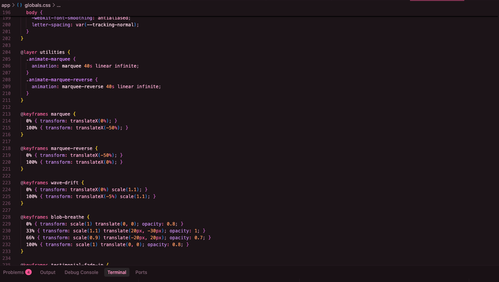
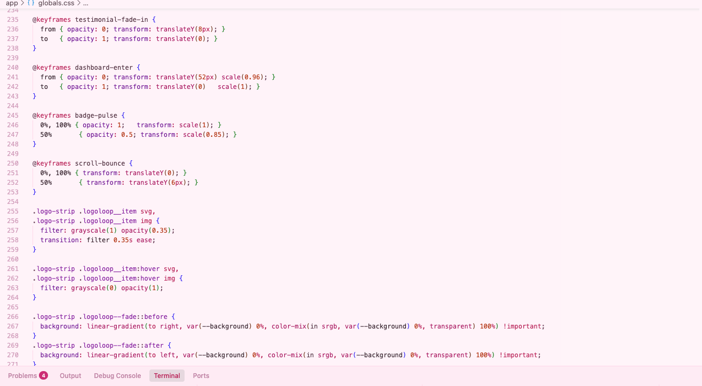
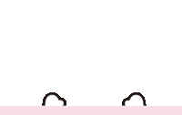

# Pink Heart Theme & Rain 💕

*Because your code editor deserves a little love, too.*

---

## English

*A Visual Studio Code extension made with love — two dreamy pink color themes and a gentle rain of hearts drifting down your sidebar. Code surrounded by softness.*

### Preview





### Features

- **Two pink themes, handcrafted with care**
  - *EL-S Dark Theme* — a warm, rose-tinted dark theme that's easy on tired eyes during long coding nights.
  - *EL-S Light Theme* — soft, pastel, and gentle like a spring morning.
  - Switch themes with `Cmd/Ctrl + K` then `Cmd/Ctrl + T` and choose your mood.

- **Heart Rain in the sidebar** 💖
  - Click the heart icon in the activity bar (the vertical icon strip on the left side).
    A **Heart Rain** view opens and little hearts fall endlessly — calm, pretty, and soothing.
  - You can also open it from the Command Palette
    (`Cmd/Ctrl + Shift + P`) with **"Heart Rain: Show"**.
  - *The background is transparent*, so the hearts float over your own sidebar color.
    The animation pauses when the view is hidden — no wasted CPU, just pure joy when you need it.




> 🎀 *These are animated GIFs — Hello Kitty appears down at the bottom of the Heart Rain sidebar.*

### Settings

| Setting | Description | Default |
| --- | --- | --- |
| `pinkHeartRain.intensity` | Hearts created per second (1–60) | `12` |
| `pinkHeartRain.speed` | Falling speed: `slow` / `normal` / `fast` | `fast` |
| `pinkHeartRain.emojis` | Emoji set used for the rain | `["💕","❤️","💖","💗","💘","💝"]` |

*All settings update the open view instantly — no restart needed.*

### Installation

Search for **Pink Heart Theme & Rain** in the VS Code Extensions marketplace, or install the `.vsix` file manually:

```bash
code --install-extension pink-heart-rain-0.0.2.vsix
```

### Development

```bash
npm install
```

*Open this folder in VS Code and press **F5**. A new Extension Development Host window opens — try the themes, watch the hearts fall, and enjoy.*

---

## Türkçe

*Kod editörünüz biraz sevgi hak ediyor, değil mi?*

*Pembe temalar ve kenara dökülen kalpler eşliğinde kod yazmak — tamamen farklı bir his.*

### Ekran Görüntüleri


### Özellikler

- **El yapımı iki pembe tema**
  - *EL-S Dark Theme* — uzun gecelerde göze iyi gelen, sıcak pembe tonlarında koyu tema.
  - *EL-S Light Theme* — yumuşak, pastel, bahar sabahı gibi nazik.
  - `Cmd/Ctrl + K` ardından `Cmd/Ctrl + T` ile istediğiniz temaya geçin.

- **Kenar çubuğunda Heart Rain** 💖
  - Soldaki etkinlik çubuğunda kalp simgesine tıklayın.
    **Heart Rain** görünümü açılır ve kalpler sürekli yağar — sakin, güzel, dinlendirici.
  - Komut paletinden (`Cmd/Ctrl + Shift + P`) **"Heart Rain: Show"** komutuyla da açabilirsiniz.
  - *Arka plan şeffaftır* — kalpler kendi tema renginizin üzerinde süzülür.
    Görünüm gizlenince animasyon durur, CPU harcamaz.


> 🎀 *Bunlar hareketli GIF'lerdir — Hello Kitty, Kalp Yağmuru kenar çubuğunun en altında görünür.*

### Ayarlar

| Ayar | Açıklama | Varsayılan |
| --- | --- | --- |
| `pinkHeartRain.intensity` | Saniyede oluşan kalp sayısı (1–60) | `12` |
| `pinkHeartRain.speed` | Düşme hızı: `slow` / `normal` / `fast` | `fast` |
| `pinkHeartRain.emojis` | Yağmurda kullanılacak emoji seti | `["💕","❤️","💖","💗","💘","💝"]` |

*Ayarları değiştirdiğinizde görünüm anında güncellenir.*

### Geliştirme

```bash
npm install
```

*Bu klasörü VS Code'da açıp **F5**'e basın. Yeni bir Extension Development Host penceresi açılır — temaları deneyin, kalplerin yağışını izleyin.*

---

*Made with 💕 by [codedbyelif](https://github.com/codedbyelif)*

## License / Lisans

MIT
